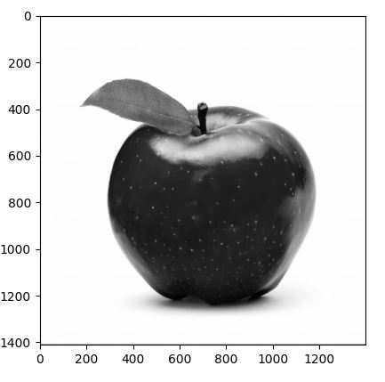

# Assignment 1: Computer Vision

## **Team 17**

**Team Members:-**

| Name      | Sec | BN     |
| :---        |    :----:   |          ---: |
| Khloud Abdulazeem        | 1       | 29   |
| Awatef Ahmed Hasan       | 2       | 6   |
| Meirna Kamal             | 2       | 36    |
| Heba Muhammed            | 2       | 42   |
| Walaa Salah Abdullatef  | 2       | 45   |

---

# Implementations:-

### 1- Add additive noise to the image  

 Uniform  
 

 Gaussian  
 

 salt & pepper noise  
 

### 2- Filter the noisy image  

Average filter  
 

median filter  
 

Gaussian filter  

### 3- Detect edges in the image  

Sobel edge detector  
 

Roberts edge detector  
 

Prewitt edge detector  
 

Canny edge detector  

### 4- Draw histogram and distribution curve  

 

### 5- Equalize the image  

 

### 6- Normalize the image  

 

### 7- Local and global thresholding  

Global  
 

Local  
 

### 8- Draw RGB histograms and distribution curves  

 

### 9- Frequency domain filters (high pass and low pass)  

high pass filter  
 

low pass filter  
 

### 10- Hybrid image   

